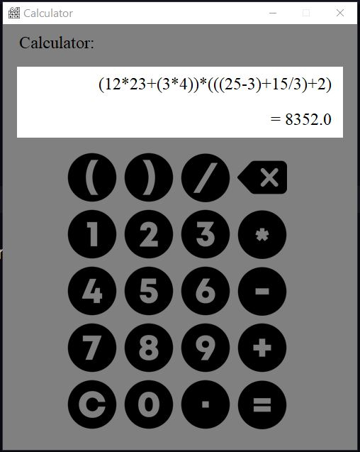
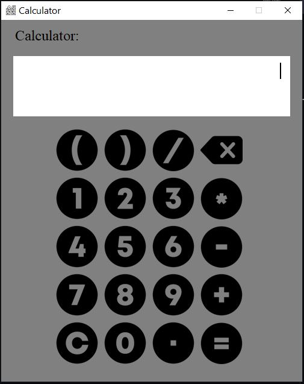

<div align="center">
  <h1 align="center"> Calculator</h1>
</div>

## About Calculator:
This is an Calculator Application made in Python using Tkinter library.The source code is available to everyone under the standard <a href a="https://github.com/AmanSinghBhogal/Calculator">MIT license</a>

## Screen Shots:
<div align="center">
  
</div>
<div align="center">
  
</div>
<div align="center">
  
</div>

### Steps to Run on Local Machine

***

#### Note: You need to have Python installed in your Local Machine if not, first install it from <a href="https://www.python.org/downloads/windows/">here</a>.
##### Step 1) Clone AmanSinghBhogal/Calculator.
##### Step 2) Open Calculator Cloned Directory in Command Prompt.
##### Step 3) Run the Following commands to install necessary Libraries:
```
pip install tk pillow
```
##### Step 4) Open Calculator.py in Visual Studio code and Click Run.


<h1 align="center">Thank You</h1>

***
